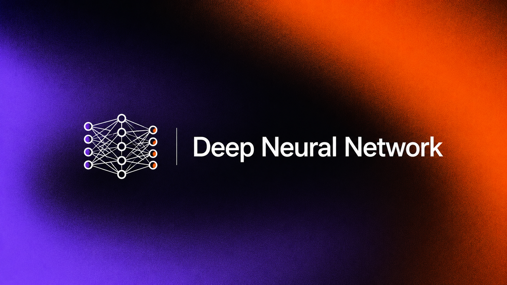

# Custom Neural Network from Scratch: Engine, 3D Visualizer & GPU Acceleration

A deep dive into the mechanics of neural networks, stripped of high-level framework abstractions. This project began as a pure NumPy implementation to master forward propagation, backpropagation, matrix calculus, and state management. It has since evolved into a full-stack, real-time application featuring high-performance GPU computation, a Go-based WebSocket server, and a live 3D React visualization—all compiled into a **single, zero-dependency binary**.

Instead of treating neural networks as black boxes, this project treats them as an explicit sequence of mathematical and physical transformations with fully traceable data flows.

---

## Evolution of the Project

1. **The NumPy Foundation:** Building the mathematical engine from scratch to explicitly map analytical gradients, matrix dimensions, and backpropagation flow without auto-differentiation.
2. **GPU Acceleration:** Porting the core matrix mathematics to use parallel GPU computing, drastically reducing execution time for dense layers.
3. **Real-Time Streaming:** Implementing a high-throughput, concurrent Go engine using WebSockets to stream training states, weights, biases, and gradients line-by-line.
4. **3D Interactive Frontend:** A React UI powered by Three.js/Fiber to render the network architecture dynamically in 3D, turning abstract arrays into a live visual matrix of firing neurons and shifting weight topologies.
5. **Single-Binary Assembly:** Packaging the entire stack (compiled frontend static assets, Go backend, and core execution engine) into one portable binary executable.

---

## Architecture Overview

The system operates as a unified, decoupled pipeline:

```
[ GPU Compute Engine ] 
        ↕ (CGO / Native Bindings)
[ Go WebSocket Server ] ──(Real-time State Stream)──> [ React 3D Dashboard ]

```

### High-Level Components

* **The Engine (Core Math):** Models the network as an ordered container of sequential layers. Each layer is responsible for its own forward transformation, caching its intermediate activation states, and computing manual gradients back to its inputs and weights.
* **The WebSocket Server (Golang):** Acts as the central nervous system. It orchestrates the training loops, handles concurrent client connections, frames system metrics, and pumps matrix deltas down the pipe with minimal latency.
* **The Visualizer (React + Three.js):** Translates incoming WebSocket streams into a real-time, nodes-and-edges 3D spatial graph. Edge thickness and color intensity correspond directly to weight magnitudes, making gradient descent visually tangible.

---

## Core Mathematical Pipeline

The API design mimics modern framework architecture (layers, forward, backward) but leaves zero room for implicit automation or graph magic.

### 1. Linear (Dense) Layer

Performs an affine transformation over an input batch $x$:

$$y = xW + b$$

Where $x$ is the input matrix, $W$ is the weight matrix, and $b$ is the bias vector.

* **Forward Pass:** Caches the input $x$ and applies the matrix multiplication.
* **Backward Pass:** Given an upstream loss gradient $\frac{\partial L}{\partial y}$, the layer manually evaluates its analytical partial derivatives:

$$\frac{\partial L}{\partial W} = x^T \cdot \frac{\partial L}{\partial y}$$


$$\frac{\partial L}{\partial b} = \sum_{\text{batch}} \frac{\partial L}{\partial y}$$


$$\frac{\partial L}{\partial x} = \frac{\partial L}{\partial y} \cdot W^T$$


### 2. Activation Functions (e.g., ReLU)

Implemented as isolated structural layers with strict mapping.

* **Forward Pass:** $y = \max(0, x)$ (caches boolean bitmask for active elements).
* **Backward Pass:** Passes gradients through only where inputs were strictly positive:

$$\frac{\partial L}{\partial x} = \frac{\partial L}{\partial y} \odot (x > 0)$$


### 3. Loss Layer (Mean Squared Error)

The terminating boundary of the computational graph.

$$L = \frac{1}{N} \sum (y_{\text{pred}} - y_{\text{true}})^2$$

* **Backward Pass:** Generates the seed gradient that starts the backward chain:

$$\frac{\partial L}{\partial y_{\text{pred}}} = \frac{2}{N} (y_{\text{pred}} - y_{\text{true}})$$


---

## Tech Stack Details

* **Backend & Orchestration:** Go (Golang) featuring native `net/http` and `gorilla/websocket`.
* **Compute Engine:** Custom implementations utilizing parallel GPU kernels for accelerated matrix algebra.
* **Frontend Visualizer:** React, Vite, Three.js (`@react-three/fiber` / `@react-three/drei`), TailwindCSS.
* **Bundling Toolchain:** Go `embed` for compiling client single-page-app (SPA) assets directly into the Go application binary.

---

## Building and Running

Because the frontend is embedded directly inside the Go code, building the project yields a single, highly portable executable.

### Prerequisites

Make sure you have Go (1.20+) and Node.js installed on your machine.

### 1. Build the Frontend

```bash
cd frontend
npm install
npm run build

```

This compiles your React assets into a static directory (e.g., `dist/`).

### 2. Compile the Unified Binary

The Go backend leverages `//go:embed` to read the compiled static directory and include it in the compiled machine code.

```bash
cd ../backend
go build -o nn-visualizer main.go

```

### 3. Execution

Run the generated executable. It spins up the computing engine, starts the WebSocket server, and hosts the visual dashboard simultaneously.

```bash
./nn-visualizer

```

Open your browser and navigate to `http://localhost:8080` (or your configured port) to see the live 3D neural network compute in real time.

---

## The Training Loop (Step-by-Step)

The loop avoids hidden callbacks, implicit graph construction, or automated state management:

1. **Forward Pass:** Compute layer activations sequentially; cache structural matrices onto the GPU/Memory.
2. **Loss Evaluation:** Calculate absolute scalar loss and initial upstream error derivatives.
3. **Backward Pass:** Stream the error gradient backward layer-by-layer; compute custom parameter deltas explicitly.
4. **WebSocket Broadcast:** Pack current weights, biases, and loss metrics into a binary/JSON packet and stream it to the React client.
5. **Parameter Update:** Update weights and biases via explicit optimizer routines: $\theta \leftarrow \theta - \eta \cdot \nabla_{\theta}L$.
6. **3D Render:** The frontend UI catches the packet, mutates the 3D node meshes, and recolors the tensor links on the fly.